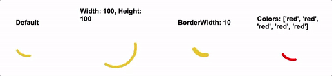

[](http://travis-ci.org/mschipperheyn/mm-loaders) [](https://www.bithound.io/github/mschipperheyn/mm-loaders) [](https://david-dm.org/mschipperheyn/mm-loaders)

# mm-loaders

MM Loaders are light weight loaders based on svg and css, using [Styled Components](https://github.com/styled-components/styled-components) to render the css.

Based on a number of sources on svg loaders, e.g. https://codepen.io/mrrocks/pen/EiplA



## Usage

### Installation

`npm install mm-loaders`

`yarn add mm-loaders`

### MDSpinner

A circular Material Design Spinner

- `colors`: (array), default: ['#4285F4', '#DE3E35', '#F7C223', '#1B9A59', '#4285F4']
- `width`: (number), default: 65
- `height`: (number), default: 65
- `borderWidth`: (number), default: 6

```JSX
import React from 'react';

import MDSpinner from 'mm-loaders/lib/MDSpinner';

const Example = () => {
    return (
        <MDSpinner/>        
    );
};

export default Example;
```

## License

*mm-loaders* is available under MIT. See LICENSE for more details.
